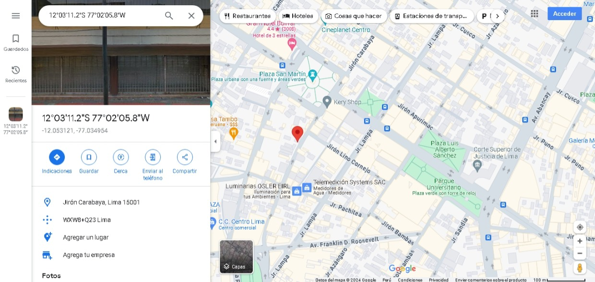
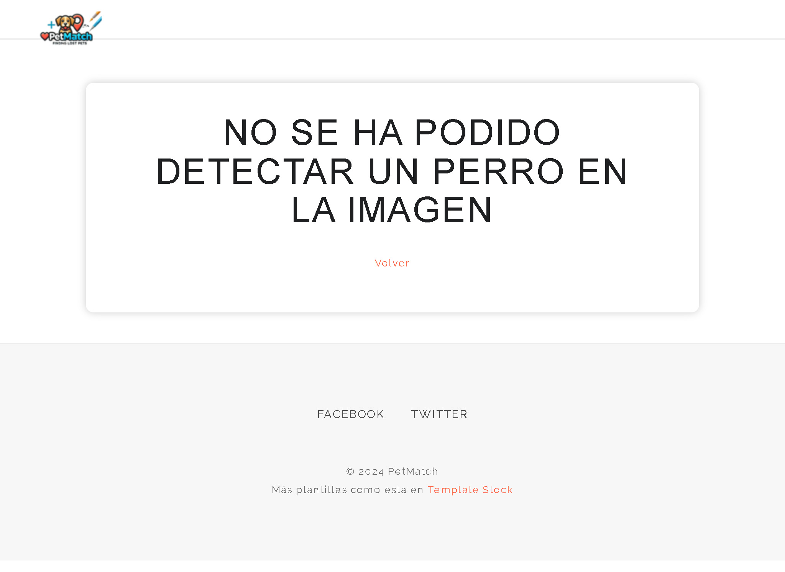
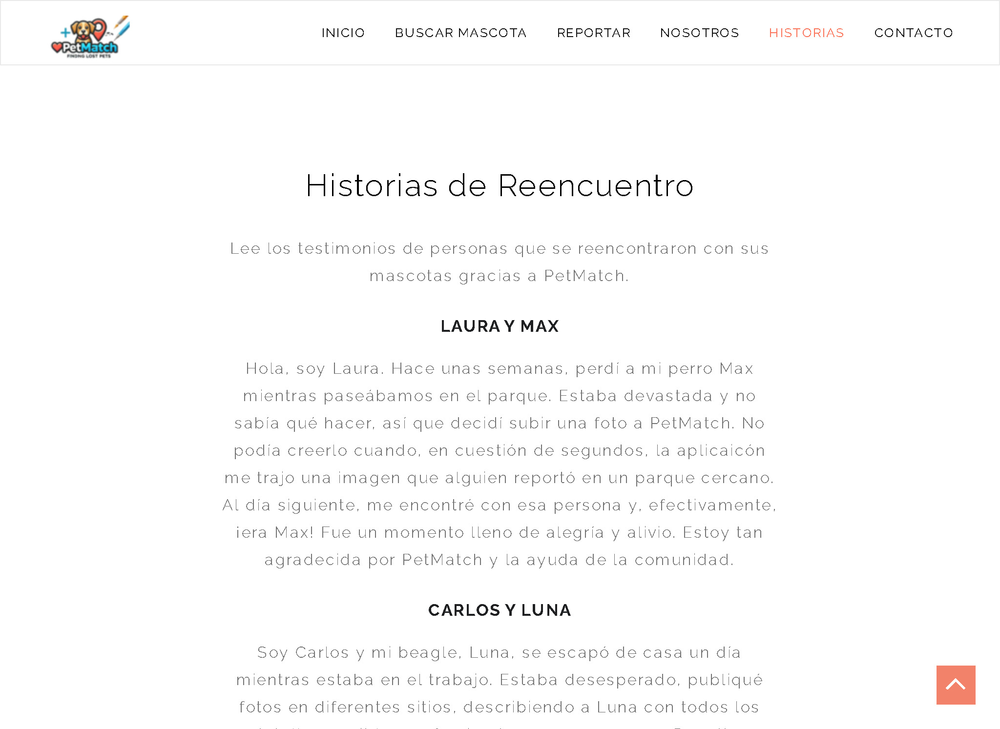

# PetMatch

Es un **prototipo web** que realiza la búsqueda de mascotas pérdidas mediante similitud de imágenes utilizando herramientas de *Deep Learning* como *Convolutional Neural Networks* (CNN), *Transfer Learning* y *Embeddings*. Este proyecto forma parte de la asignatura "*Data Analytics* para la toma de decisiones" que se imparte en la Maestría en *Computer Science* de la Escuela de Posgrado de la Universidad de Ingeniería y Tecnología (UTEC) cuyo docente es Germaín García, *Phd.* en *Computer Science*. 

Si bien este proyecto se encuentra en una etapa de MVP tiene como principal objetivo, en un horizonte de mediano y largo plazo, convertirse en el portal de búsqueda de mascotas perdidas más utilizado en Perú y Latinoamérica, respectivamente.


## Cifras y trabajos previos

* Cada año en Perú, aproximadamente 420,000 mascotas, principalmente perros y gatos, se pierden debido a la falta de identificación. Solo una pequeña fracción es recuperada. Las principales causas de pérdida incluyen robos, mascotas dejadas solas, asustadas por ruidos fuertes o perdidas de vista por sus dueños. Se ha desarrollado un nuevo localizador con código QR para mejorar la identificación y recuperación. Este método permite acceder a una ficha virtual con información relevante y ubicación de la mascota cuando se escanea el código​ ([Andina](https://andina.pe/agencia/noticia-unas-420000-mascotas-se-pierden-cada-ano-peru-falta-identificacion-732435.aspx))​.

* En 2022, el proyecto "Alerta Me Perdí" reportó 1706 animales perdidos en Guayaquil, con un 79% de perros y un 21% de gatos. El 25% de los animales regresaron a sus hogares, una mejora respecto al 21% del primer semestre. Solo el 12% de los animales tenían collar y placa, y el 22% estaban esterilizados. La mayoría de los reportes provinieron de Guayas (89%) y Guayaquil (93%). Los sectores con más reportes fueron Suburbio (14%) y Sauces (9%) ([rescateanimal.org.ec](https://rescateanimal.org.ec/estadisticas2022/)).

* La aplicación móvil "Pata de Perro" fue creada por Jonet Lazo y Viviana Arce para ayudar a reducir el número de mascotas perdidas en Perú. Utiliza la geolocalización para facilitar el reencuentro de mascotas con sus dueños, permitiendo publicar avisos de mascotas perdidas y encontradas con detalles y datos de contacto. Una encuesta, realizada por dicho equipo, reveló que solo el 18% de los perros perdidos regresan a sus hogares y el 58% de las personas no saben qué hacer al encontrar un perro perdido. La app también ofrece placas con código QR para una identificación más segura ([El Comercio](https://elcomercio.pe/wuf/noticias/app-movil-busca-minimizar-numero-mascotas-perdidas-noticia-449449-noticia/?ref=ecr)).

## Nuestro equipo 
| [](ruta/a/la/foto1.jpg) | [](ruta/a/la/foto2.jpg) | [](ruta/a/la/foto3.jpg) | 
|:--:|:--:|:--:| 
| **José Zuñiga** | **Jeyson Lino** | **Juan Herencia** |
| Entusiasta tecnológico e ingeniero industrial con ocho años de experiencia en el sector público y privado. Cinco años de experiencia en temas vnculados con propiedad intelectual, innovación y patentes y tres años en temas vinculados con gestión de la información, dashboarding y explotación de datos. Cuenta con especializaciones en data analytics, machine learning y deep learning por diferentes instituciones. Al 2024, maestrando en computer science por la escuela de posgrado de UTEC. | Ingeniero de sistemas con más de 7 años de experiencia en analítica de datos. Sólidos conocimientos en herramientas de procesamiento, análisis y visualización de datos. Busco crear valor mediante el desarrollo de soluciones analíticas que permitan evidenciar la importancia de una toma de decisiones basada en datos. Data Scientist en progreso. | Profesional con experiencia en dirección y desarrollo de soluciones en tecnologías de la información para el sector público y privado. Con especialización en análisis de datos y uso de herramientas de Machine Learning, Deep Learning e IA. |

## Publico objetivo
Dueños de mascotas perdidas en territorio peruano. En esta primera etapa del proyecto solo se trabajará con perros, sin embargo, se planifica ampliar el espectro de mascotas buscadas a gatos, canarios y otros. Así mismo se tiene como objetivo ampliar el público a otros países de Latinoamérica.

## Funcionalidades MVP de PetMach
Actualmente el producto mínimo viable trabaja con dos funcionalidades principalmente: búsqueda de perros por similitud de imágenes y reporte de posible perro perdido.

### Búsqueda de perros por similitud de imágenes
Esta funcionalidad permite que el usuario cargue una imagen de su perro. El sistema realiza una búsqueda por similitud de imágenes en la base de datos de perros reportados como perdidos y devuelve las 6 imágenes que contienen los perros más parecidos en orden de similitud.

**Diagrama de flujo del proceso general para la búsqueda de un perro en PetMatch**


**Buscar a partir de una imagen con perro**
| [](Capturas/Buscar_mascota.jpg) | [](Capturas/seleccion_perro.jpg) | [](Capturas/resultados_perros.jpg) | 
|:--:|:--:|:--:| 

>El proceso detecta que hay un perro en la imagen y procede con la búsqueda en la base de datos.

Adicionalmente en la página de resultados cada imagen posee un enlace de geolocalización que redirige al usuario hacia google maps. En la ventana de google maps se encuentra un pin sobre la ubicación donde la foto fue tomada. Con esta funcionalidad se busca ayudar al usuario con la ubicación de la última vez que se vio a su mascota.

<div style="text-align: center;">
    
</div>

**Buscar a partir de una imagen con un pato**
| [](Capturas/Buscar_mascota.jpg) | [](Capturas/seleccion_pato.jpg) | [](Capturas/pantalla_no_perro.jpg) | 
|:--:|:--:|:--:| 

>El proceso detecta que no hay un perro en la imagen y envía un mensaje al usuario y no llama a la función de bpusqueda.

>**Nota importante:** En esta etapa del proyecto solo se permite que el usuario cargue una foto a la vez para realizar la búsqueda. En posteriores actualizaciones se planea permitir que el usuario pueda cargar varias fotos a la vez con la intención de obtener un mejor resultado.

### Reporte de posible perro perdido
Esta funcionalidad permite que el usuario pueda reportar a un perro que encontró perdido. Esta sección depende del apoyo de la comunidad por lo que es indispensable promover e incentivar la acción de reportar.

**Diagrama de flujo del proceso general del reporte de perro perdido**


**Reportar a partir de una imagen con perro**
| [](Capturas/Buscar_mascota.jpg) | [](Capturas/seleccionar_perro_reporte.jpg) | [](Capturas/mensaje_exito_reporte.jpg) | 
|:--:|:--:|:--:| 

>El proceso detecta que hay un perro en la imagen y procede con la preparación de la imagen para almacenarla en la base de datos.

## Sección de historias de éxito

En esta sección el usuario puede visualizar las historias de reencuentro gracias a la herramienta. Son historias cargadas por los usuarios. Actualmente no está disponible aún un formulario para cargar las historias directamente por el usuario por lo que la historia se recopila y carga directamente por el equipo de PetMatch.



## Explicación del código

Para este proyecto se aprovecharon modelos pre-entrenados como ResNet50 y YoloV5 para la extracción de *embeddings* y detección de perros en imágenes respectivamente.

A continuación se detallan los códigos más importantes para el funcionamiento:

- Cargar modelo ResNet50 preentrenado con los pesos del conjunto de datos imagenet.
	```python
	base_model  = ResNet50(weights='imagenet')
	model  = Model(inputs=base_model.input, outputs=base_model.get_layer('avg_pool').output)
	```

- Función para la extracción de *embeddings* a partir de una imagen

	```python
	def  extract_embedding(img_path):
		img  = image.load_img(img_path, target_size=(224, 224))
		img_data  = image.img_to_array(img)
		img_data  =  np.expand_dims(img_data, axis=0)
		img_data  = preprocess_input(img_data)
		embedding  =  model.predict(img_data)
		return  embedding.flatten()
	```

	La línea ```embedding  =  model.predict(img_data)``` utiliza el modelo ResNet50 para obtener el *embedding*.

- Función para encontrar las 5 imágenes más cercanas.

	```python
	def  find_similar_images(query_img_path, k=5):
		query_embedding  =  extract_embedding(query_img_path)
		with  open('embeddings.pkl', 'rb') as  f:
			embeddings, image_paths  =  pickle.load(f)
			
		distances  =  cosine_distances([query_embedding], embeddings)[0]
		nearest_indices  =  distances.argsort()[:k]
		similar_images  = [image_paths[i] for  i  in  nearest_indices]
		
		return  similar_images
	```
	Para este propósito se utilizó la ```distancia coseno``` como parámetro de similitud. Un valor cercano a 1 indica que las imágenes son similares.

- Cargar el modelo Yolov5

	```python
	model_yolo  =  torch.hub.load('ultralytics/yolov5', 'yolov5s', pretrained=True)
	```
 
- Función para validar que la imagen contiene un perro
	```python
	def is_dog(imagen_path):    
	    img = cv2.imread(imagen_path)
	    results = model_yolo(img)    
	    etiquetas = results.pred[0][:, -1].cpu().numpy()
	    
	    return 16 in etiquetas
	```
 La línea ```results = model_yolo(img)``` utiliza el modelo Yolov5 para obtener el identificar si la imagen contiene un perro. ```16 in etiquetas``` hace referencia a la presencia de la etiqueta 16 la cual representa a "perro".


